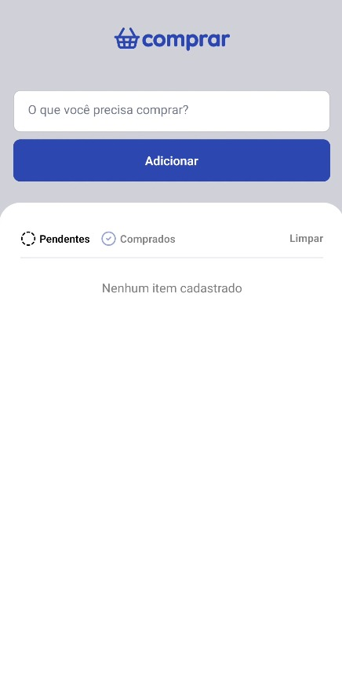

# Comprar


Aplicativo simples para gerenciar listas de compras, feito com React Native e Expo.

## Demonstração


## Screenshots

<div align="center">
  
  
</div>

## Vídeo

<video src='./assets/ComprarApp.mp4' />

## Funcionalidades

- Adicionar, editar e remover itens da lista
- Marcar itens como comprados ou pendentes
- Filtros por status
- Interface intuitiva e responsiva

## Tecnologias Utilizadas

- [React Native](https://reactnative.dev/)
- [Expo](https://expo.dev/)
- TypeScript

## Instalação

1. Clone o repositório:
   ```bash
   git clone https://github.com/seu-usuario/comprar.git
   cd comprar
   ```
2. Instale as dependências:
   ```bash
   npm install
   ```
3. Rode o projeto:
   ```bash
   npx expo start
   ```

## Publicação Expo

Acesse o app via Expo:
[https://expo.dev/@seu-usuario/comprar](https://expo.dev/@seu-usuario/comprar)

## Como Contribuir

1. Faça um fork do projeto
2. Crie uma branch para sua feature (`git checkout -b feature/nome-feature`)
3. Commit suas alterações (`git commit -m 'feat: minha feature'`)
4. Push para a branch (`git push origin feature/nome-feature`)
5. Abra um Pull Request

## Licença

Este projeto está sob licença MIT.

---

> Feito com ❤️ por [Seu Nome](https://github.com/seu-usuario)
