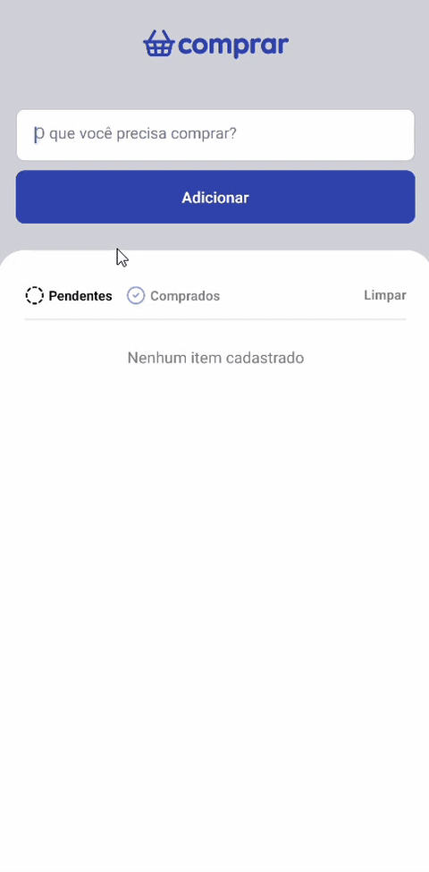

<div align="center">
  
</div>

# Comprar App


Aplicativo simples para gerenciar listas de compras, feito com React Native e Expo.

## Demonstração

<div align="center">
  
</div>

## Screenshots

<div align="center">
  
  
</div>

## Funcionalidades

- Adicionar e remover itens da lista
- Marcar itens como comprados ou pendentes
- Filtros por status
- Limpar lista
- Interface intuitiva

## Tecnologias Utilizadas

- [React Native](https://reactnative.dev/)
- [Expo](https://expo.dev/)
- TypeScript

## Instalação

1. Clone o repositório:
   ```bash
   git clone https://github.com/brunosaibert/comprar.git
   cd comprar
   ```
2. Instale as dependências:
   ```bash
   npm install
   ```
3. Rode o projeto:
   ```bash
   npx expo start
   ```

## Publicação Expo

Acesse o app via Expo:
[Clique AQUI](https://expo.dev/preview/update?message=feat%3A+publish+app+eas&updateRuntimeVersion=1.0.0&createdAt=2025-07-29T20%3A22%3A48.386Z&slug=exp&projectId=c8be6804-640b-4d41-9a2e-649de625ceeb&group=bf5cb767-4697-47e0-8c88-b61c015a7e0f)

## Como Contribuir

1. Faça um fork do projeto
2. Crie uma branch para sua feature (`git checkout -b feature/nome-feature`)
3. Commit suas alterações (`git commit -m 'feat: minha feature'`)
4. Push para a branch (`git push origin feature/nome-feature`)
5. Abra um Pull Request

## Licença

Este projeto está sob licença MIT.

---

> Feito com ❤️ por [Bruno Henrique Saibert](https://github.com/brunosaibert)
